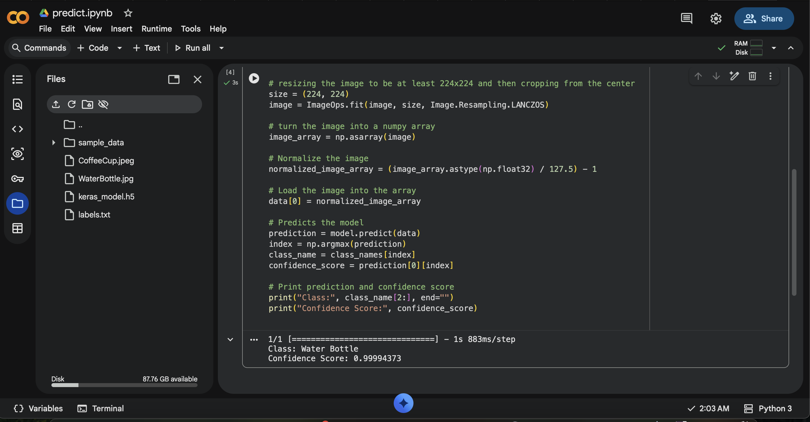
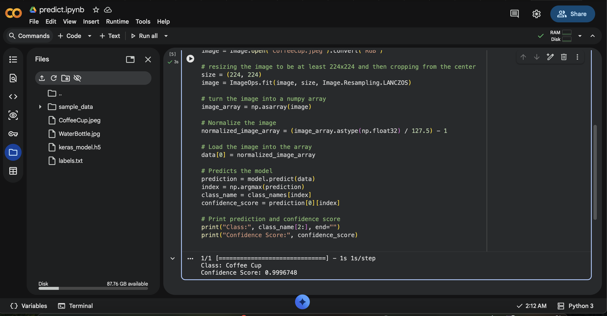

# Task 01 – Image Recognition Using Google Teachable Machine

## 📌 Overview

This project demonstrates a simple image classification model developed using **Google Teachable Machine**. The model was trained to recognize two object classes:

- 💧 Water Bottle
- ☕ Coffee Cup

After training, the model was exported in **TensorFlow (Keras)** format and integrated into a Python script to classify new images.

---

## 🎯 Objectives

- Train an image classification model using Google Teachable Machine.
- Use two image classes.
- Export the trained model in TensorFlow (Keras) format.
- Load the model using Python.
- Predict the class of an input image.
- Evaluate the model using test images.

---

## 🛠️ Tools & Technologies

- Google Teachable Machine
- TensorFlow / Keras
- Python
- NumPy
- Pillow

---

## 📂 Project Structure

```text
Task-02-Image-Recognition-Using-Teachable-Machine/
│
├── README.md
├── predict.py
├── requirements.txt
│
├── model/
│   ├── keras_model.h5
│   └── labels.txt
│
├── test_images/
│   ├── water_bottle.jpg
│   └── coffee_cup.jpg
│
└── screenshots/
    ├── training.png
    ├── prediction_water.png
    └── prediction_coffee.png
```

---

## 📊 Classes

| Class | Description |
|--------|-------------|
| Water Bottle | Images of water bottles captured from different angles |
| Coffee Cup | Images of coffee cups captured from different angles |

---

## 📝 Steps

### 1. Create the Dataset

- Open Google Teachable Machine.
- Create a new Image Project.
- Add two classes:
  - Water Bottle
  - Coffee Cup
- Capture multiple images for each class from different angles and lighting conditions.

### 2. Train the Model

- Click **Train Model**.
- Wait until the training process is completed.
- Test the model using the preview window.

### 3. Export the Model

- Click **Export Model**.
- Select **TensorFlow → Keras**.
- Download the exported files:
  - `keras_model.h5`
  - `labels.txt`

### 4. Python Prediction

- Open the project in your Python environment.
- Install the required libraries.

```bash
pip install -r requirements.txt
```

- Run the prediction script.

```bash
python predict.py
```

- The program displays the predicted class and confidence score.

### 5. Evaluate the Model

- Test the model using new images of a water bottle and a coffee cup.
- Compare the prediction results with the actual object.

---

## 📸 Results

### Water Bottle Prediction



### Coffee Cup Prediction



---

## 📚 Learning Outcomes

Through this task, I learned how to:

- Build an image classification model using Google Teachable Machine.
- Export a TensorFlow (Keras) model.
- Load and use the trained model in Python.
- Predict image classes from new input images.
- Document AI projects using GitHub.

---

## 👩‍💻 Author

**Arwa AlZain**

Computer Science Student

Qassim University

Summer Training Program – 2026
