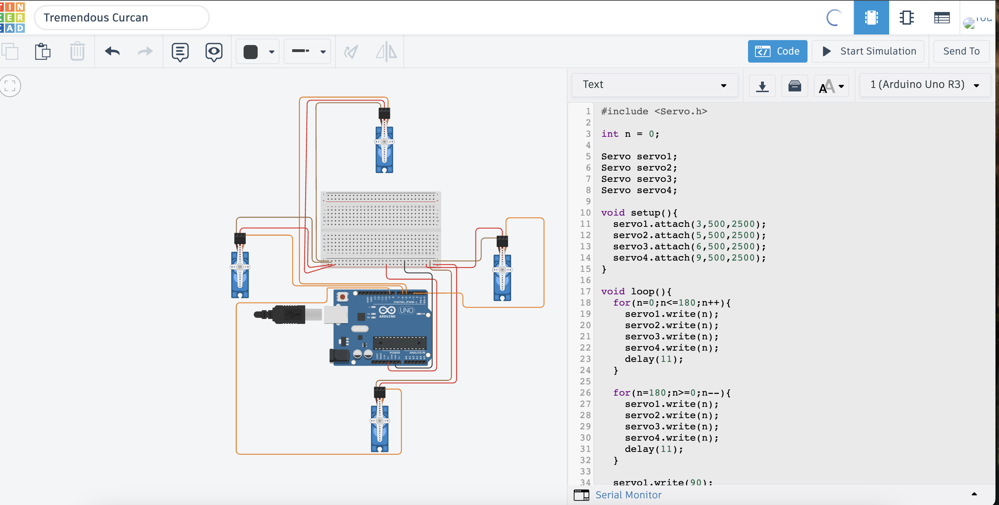

# 4-Servo Motors Control using Arduino (Tinkercad Simulation)

A GitHub repository demonstrating how to control and synchronize four micro servo motors using an Arduino Uno. The system executes a controlled **Sweep** movement for approximately 2 seconds, followed by an immediate and permanent hold at **90 degrees**.

---

## 🚀 Project Overview

The core objective of this project is to manage multiple servo motors simultaneously directly through the Arduino Uno framework. By utilizing Arduino's **5V output** and its dedicated **PWM pins**, the motors operate smoothly in complete synchronization without requiring an external power grid within the simulation environment.

### Key Features:
* **Synchronized Sweep:** Simultaneous sweep motion across all 4 motors (from 0° to 180° and back to 0°).
* **Precise Holding State:** Programmed to halt and hold firmly at exactly 90° after the initial movement sequence.
* **Streamlined Power Layout:** Powered directly via the Arduino 5V internal regulator rail, sharing a unified ground connection across the breadboard.

---

## 🛠️ Components Used
* **1x** Arduino Uno R3
* **1x** Breadboard
* **4x** Micro Servo Motors (SG90)
* Connecting Wires

---

## 🔌 Circuit Schema & Wiring

To ensure proper functionality, the common power and ground distribution methodology from the Arduino Uno is implemented below:

| Component Pin | Connected To | Connection Type |
| :--- | :--- | :--- |
| **Servo 1-4 Power (Red)** | Breadboard Positive Rail `(+)` | Powered by **Arduino 5V Pin** |
| **Servo 1-4 GND (Brown)**| Breadboard Negative Rail `(-)` | Shared Ground Row |
| **Arduino GND (Black)** | Breadboard Negative Rail `(-)` | Connected to Breadboard Negative Rail |
| **Arduino 5V Pin (Red)** | Breadboard Positive Rail `(+)` | **Main Power Source** for the Rails |
| **Servo 1 Signal (Orange)** | Arduino Digital Pin **3** | PWM Signal |
| **Servo 2 Signal (Orange)** | Arduino Digital Pin **5** | PWM Signal |
| **Servo 3 Signal (Orange)** | Arduino Digital Pin **6** | PWM Signal |
| **Servo 4 Signal (Orange)** | Arduino Digital Pin **9** | PWM Signal |

---

## 💻 Code Implementation

```cpp
#include <Servo.h>

int n = 0;

// Define 4 Servo objects
Servo servo1;
Servo servo2;
Servo servo3;
Servo servo4;

void setup(){
  // Attach servos to PWM pins and specify precise pulse width ranges (500, 2500)
  servo1.attach(3, 500, 2500);
  servo2.attach(5, 500, 2500);
  servo3.attach(6, 500, 2500);
  servo4.attach(9, 500, 2500);
}

void loop(){
  // 1. Forward Sweep (0 to 180 degrees)
  for(n = 0; n <= 180; n++){
    servo1.write(n);
    servo2.write(n);
    servo3.write(n);
    servo4.write(n);
    delay(11);
  }
  
  // 2. Backward Sweep (180 to 0 degrees)
  for(n = 180; n >= 0; n--){
    servo1.write(n);
    servo2.write(n);
    servo3.write(n);
    servo4.write(n);
    delay(11);
  }
  
  // 3. Move all motors to the final holding state at 90 degrees
  servo1.write(90);
  servo2.write(90);
  servo3.write(90);
  servo4.write(90);
  
  // Infinite loop to lock the program and prevent repetitive sweeps
  while(true){};
}
```

---

## 📸 Media & Demonstration

### Circuit Simulation Preview


### Working Demo (Simulation Video)
Detailed demonstration video showcasing the synchronized sweep behavior and the permanent lock at 90°:


---

