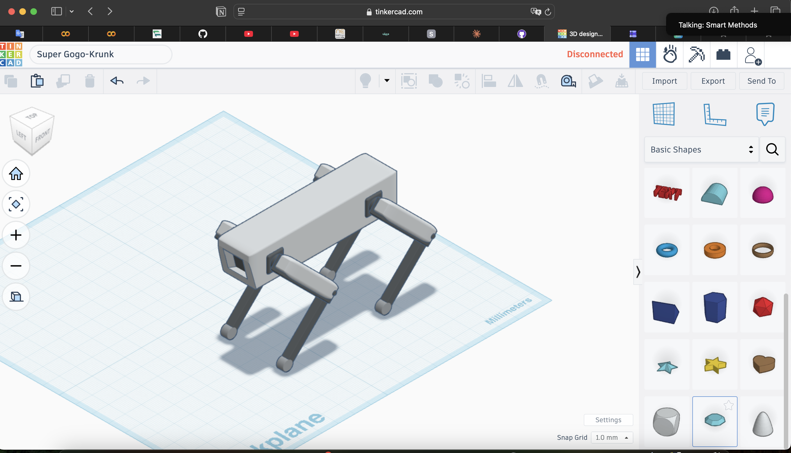
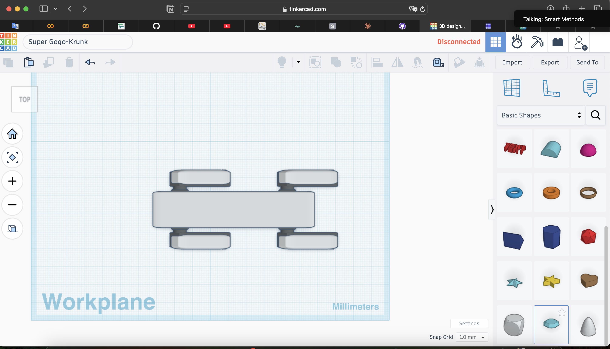
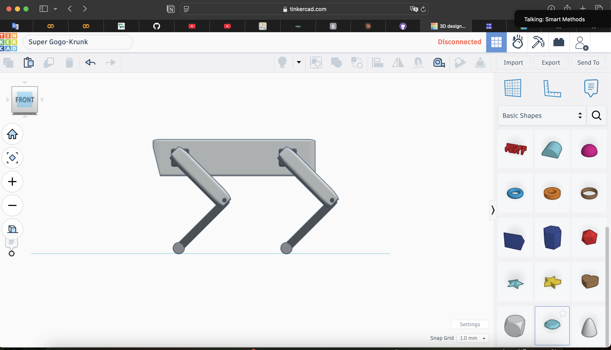
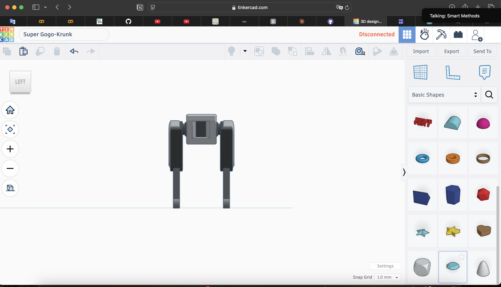

# Task 01 – Robot Dog Mechanical Design

## 📌 Overview

This project presents the preliminary mechanical design of a simple quadruped robot (Robot Dog) created using **Tinkercad**. The objective is to understand the fundamental mechanical concepts required for a robot to stand, maintain stability, and perform basic walking movements.

The project focuses on the mechanical structure rather than the electronic or control systems.

---

## 🎯 Objectives

- Design a simple quadruped robot body (chassis).
- Create a basic four-leg mechanical structure.
- Define the number of Degrees of Freedom (DOF).
- Select appropriate servo motors.
- Perform an initial torque estimation for one joint.
- Consider stability and center of gravity.
- Propose a suitable walking gait.
- Identify potential mechanical challenges.

---

## 🛠️ Software Used

- **Tinkercad** – 3D Mechanical Design
- **Pages** – Report Writing

---

## 📐 Robot Specifications

| Specification | Value |
|---------------|-------|
| Body Length | 90 mm |
| Body Width | 28 mm |
| Body Height | 20 mm |
| Number of Legs | 4 |
| Degrees of Freedom | 8 DOF |
| Walking Method | Crawl Gait |

---

## 📂 Project Structure

```text
Task-01-Robot-Dog-Mechanical-Design/
│
├── README.md
├── Report/
│   └── Robot_Dog_Mechanical_Design_Report.pdf
│
├── Images/
│   ├── isometric-view.png
│   ├── top-view.png
│   ├── side-view.png
│   └── front-view.png
│
└── Tinkercad/
    └── RobotDogDesign.stl
```

---

## 📸 Design Preview

### Isometric View



### Top View



### Side View



### Front View



---

## 🚶 Proposed Walking Method

The robot uses a **Crawl Gait**, where only one leg moves at a time while the other three legs remain on the ground. This gait provides better stability and is suitable for simple quadruped robots.

---

## 📄 Documentation

The complete project report is available in the **Report** folder.

---

## 📚 Learning Outcomes

Through this task, I learned how to:

- Design a simple mechanical chassis.
- Build a basic quadruped leg structure.
- Understand Degrees of Freedom (DOF).
- Estimate joint torque requirements.
- Consider robot stability and center of gravity.
- Organize engineering documentation.

---

## 👩‍💻 Author

**Arwa AlZain**

Computer Science Student

Qassim University

Summer Training Program – 2026
