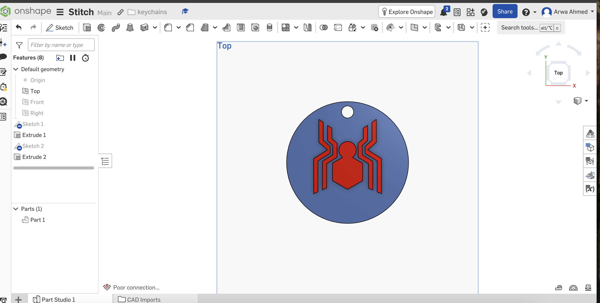

# Task-02-Onshape-Spider-Man-Keychain 

## Description
Welcome to the repository for Mechanical Task 2. For this Task, the **Spider-Man Keychain** was chosen to design a custom, 3D-printable keychain. The dimensions were meticulously embedded into the model and exported directly.

---

## 🛠️ Workflow & Technical Analysis

This section outlines the process of transforming the Spider-Man emblem into a functional 3D model.

1.  **Concept Selection & Scaling:** Selected the Spider-Man emblem and scaled it to a functional keychain size (approximately 35mm - 45mm bounding range).
2.  **2D Sketching:** Traced and drafted the logo details using parametric constraints inside the Onshape sketch studio.
3.  **Keyring Attachment:** Incorporated a circular cut through-hole with a diameter of **4 mm** to accommodate standard keyrings.
4.  **Extrusion:** Applied an extrusion depth of exactly **2 mm** to achieve a lightweight yet rigid structure.
### 🖼️ Design Preview

Here is a visual representation of the final CAD model:



5.  **Validation & Export:** Verified mesh integrity and exported the finished model as an **STL** file for 3D printing.
   
## Repository Structure
```
Task-02-Onshape-Spider-Man-Keychain/
├── README.md
├── OSpiderMan-Keychain.stl
└── Images/
    └── SpiderMan-Keychain.png
```

---

## 🔗 Project Links

*   **Onshape Design Link:** [Click here to view the live design]([Insert_Your_Onshape_Link_Here](https://cad.onshape.com/documents/abfe16faeeb0ca89288e78f9/w/3f8a98b7a4a23adc3b7b1408/e/638a46f06a9f2f0c22ae9df7?renderMode=0&uiState=6a5c1f99f648b00d07e50dbe))
*   **3D Model File:** The verified `SpiderMan-Keychain.stl` file is uploaded directly to this repository.

> ⚠️ **Important Note:** To open the live 3D model successfully, please **right-click** on the link and select **"Open link in new tab"**. Clicking the link directly may result in a "403 Forbidden" or "Not Found" error due to browser routing restrictions.
>
---
## 👩‍💻 Author

**Arwa AlZain**

Computer Science Student

Qassim University

Summer Training Program – 2026
