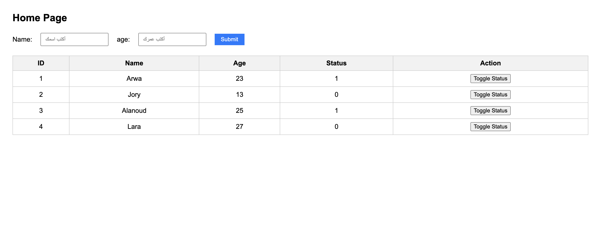
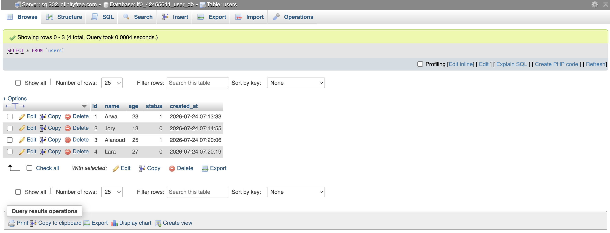

# Task-02- Real-Time User Management System with AJAX Status Toggle

A full-stack web application designed to handle user records and perform real-time database updates. This project features a clean one-line input form, dynamic data rendering, and an asynchronous **AJAX-powered status toggle** that reflects changes instantly on the webpage without full page reloads.

---

## 🛠️ Tech Stack

* **Front-End:** HTML, CSS (Flexbox & Responsive Table Layouts), Vanilla JavaScript (`XMLHttpRequest`).
* **Back-End:** PHP.
* **Database:** MySQL.
* **Environment Compatibility:** Works seamlessly with local servers (XAMPP) and web hostings (InfinityFree).

---

## 📸 Screenshots

### 🌐 Application User Interface


### 🗄️ phpMyAdmin Database Structure & Data


---

## 📁 Repository Structure

```text
├── db.php              # Centralized database connection configuration
├── index.php           # Main UI (Form, JS handler, and views container)
├── insert.php          # Backend handler for adding new user records
├── select.php          # Dynamic SQL query handler to display the data table
├── toggle_status.php   # Asynchronous API endpoint for live status updates
├── screenshots/        
│   └── ApplicationUserInterface.png
│   └── phpMyAdminDatabase.png
└── README.md           # Technical documentation
```

---

## 🗄️ Database Setup

Create a database and execute the following SQL statement to set up the `users` table:

```sql
CREATE TABLE IF NOT EXISTS users (
    id INT AUTO_INCREMENT PRIMARY KEY,
    name VARCHAR(255) NOT NULL,
    age INT NOT NULL,
    status TINYINT(1) DEFAULT 0,
    created_at TIMESTAMP DEFAULT CURRENT_TIMESTAMP
);
```

---

## 💡 System Architecture & Technical Highlights

### 1. One-Line Form Layout
The input form is designed using CSS Flexbox (`display: flex`), placing all input controls (Name, Age, and Submit Button) inline on a single row. This delivers a compact and modern user interface.

### 2. Dynamic Data Fetching (`insert.php` & `select.php`)
* Submitting new user entries triggers `insert.php`, storing the user's name and age while setting `status` to `0` by default.
* `select.php` dynamically fetches and builds the records table. Each status cell is assigned a unique DOM ID (`status_{id}`) to allow targeted JavaScript DOM manipulation.

### 3. Asynchronous Status Switching (`toggle_status.php` & AJAX)
When clicking the **Toggle Status** button:
1. JavaScript triggers an asynchronous GET request to `toggle_status.php` passing the user `id`.
2. The server reads the existing status, flips it (`0` to `1` or `1` to `0`), and updates MySQL.
3. The server responds only with the updated single digit (`0` or `1`).
4. JavaScript catches the response and updates the inner text of `#status_{id}` instantly in real time—eliminating the need for a page refresh.

---

## 📌 Web Hosting Deployment Notes

* **Linux Case-Sensitivity:** Ensure that all references to `toggle_status.php` strictly match the exact casing on Linux web servers.
* **Server Credentials:** Update `db.php` with your hosting environment details (MySQL Hostname, Database Name, DB Username, and Password).

---

## 👩‍💻 Author


**Arwa AlZain**

Computer Science Student

Qassim University

Summer Training Program - 2026
