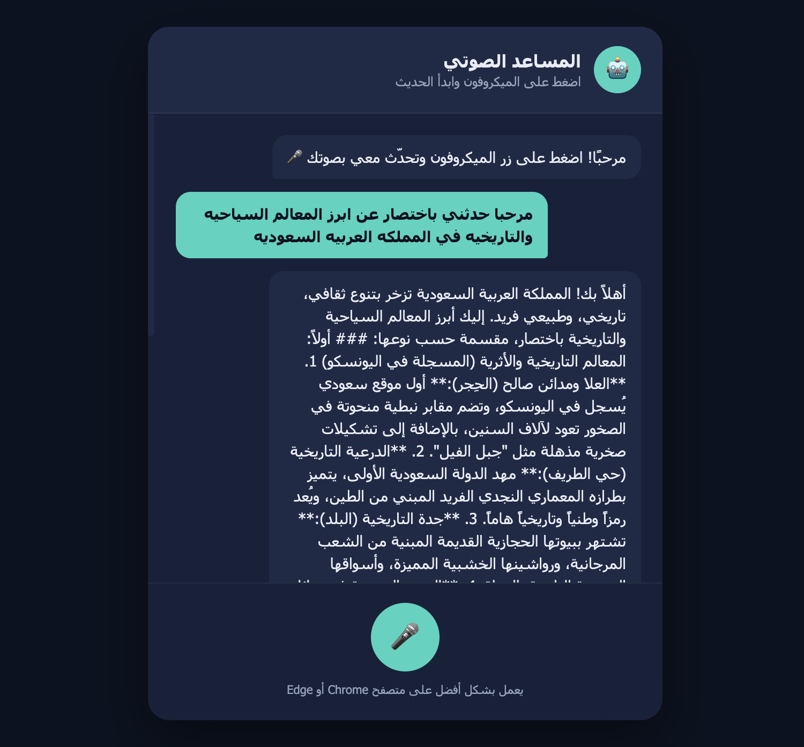

# 🤖 Task-03- Voice-Enabled AI Chatbot (Google Gemini API)

A full-stack, voice-interactive AI chatbot built with a dynamic **HTML/CSS/JavaScript** front-end and a secure **PHP** backend. The application enables users to interact with Google's Gemini LLM via Speech-to-Text (STT) and Text-to-Speech (TTS) natively inside the browser.

---
## 📸 Screenshot



---
## 📌 Features

- **Voice Input (Speech-to-Text):** Integrated using browser-native `SpeechRecognition` API (Optimized for Arabic `ar-SA`).
- **Voice Output (Text-to-Speech):** Automatic vocalization of model responses using `SpeechSynthesis`.
- **Secure API Key Handling:** Proxied backend requests via PHP (`askbot.php`) to keep Gemini API credentials safe from public exposure.
- **Responsive UI:** Clean, modern, dark-themed interface built with custom CSS.

---

## 📁 Project Structure

```text
Task-03-Voice-Chatbot-Gemini/
├── index.html           # Primary UI & Document Layout
├── style.css            # Visual styling and responsive design
├── app.js               # Client-side logic (Speech Recognition, Audio Synth, Fetch API)
├── config.example.php   # Protected configuration file storing the Gemini API Key
├── askbot.php           # PHP Backend Handler (Proxies requests to Google Gemini REST API)
screenshots/        
│   └──  Gemini-API.png
└── README.md            # Technical documentation
```

---

## 🛠️ Setup & Deployment Guide

### 1. Gemini API Setup
1. Visit **Google AI Studio** and generate a new API key.
2. Select *"Create API Key in new project"* to ensure full rate limit availability.

### 2. Configuration Setup
Create a `config.php` file in your root folder:

```php
<?php
// config.php
define('GEMINI_API_KEY', 'YOUR_ACTUAL_GEMINI_API_KEY_HERE');
```

> **Note:** For local testing or GitHub documentation, use `config.example.php` (never commit your live API key).

### 3. Server Deployment (InfinityFree Hosting)
1. Log in to your **InfinityFree Control Panel** and access the File Manager.
2. Navigate to the `htdocs/` directory.
3. Upload all project files inside your target directory (e.g., `htdocs/task3/`).
4. **Important:** Enable **Free SSL (HTTPS)** in InfinityFree control panel. Browser media features like Speech Recognition require a secure context (`https://`).

---

## 🔍 Issues Encountered & Solutions (Troubleshooting Log)

During deployment on InfinityFree, several standard web integration and environment issues were identified and resolved:

### ❌ Issue 1: 404 Not Found Request Failure
- **Symptom:** Browser failed to send POST requests, returning a 404 status error on audio submission.
- **Root Cause:** Path mismatch between the endpoint declared in `app.js` (`api/chat.php`) and the actual backend file name/location (`task3/askbot.php`).
- **Solution:** Updated the target URL inside `app.js`:
  ```javascript
  const BACKEND_URL = "./askbot.php";
  ```
  Also aligned `askbot.php` to include `config.php` from the local directory instead of a relative parent path:
  ```php
  require __DIR__ . './config.php';
  ```

### ❌ Issue 2: 500 Internal Server Error & cURL SSL Certificate Rejection
- **Symptom:** Backend execution halted with HTTP Status 500 when attempting to contact Google servers.
- **Root Cause:** Free web hosts (like InfinityFree) often lack updated root CA certificates required by cURL (cURL error 60).
- **Solution:** Configured cURL options within `askbot.php` to bypass peer SSL verification:
  ```php
  curl_setopt($ch, CURLOPT_SSL_VERIFYPEER, false);
  curl_setopt($ch, CURLOPT_SSL_VERIFYHOST, false);
  ```

### ❌ Issue 3: Stale Asset Caching (Unupdated Code Changes)
- **Symptom:** Code modifications made on the server were not reflecting when testing in the browser.
- **Root Cause:** Aggressive browser and CDN caching of JavaScript files.
- **Solution:** Implemented asset versioning in `index.html`:
  ```html
  <script src="app.js?v=1"></script>
  ```

### ❌ Issue 4: 429 Too Many Requests / Rate Limiting
- **Symptom:** Backend returned HTTP 429 errors from Google API.
- **Root Cause:** Project quota limit exhaustion or rapid sequence trigger of `SpeechRecognition.onresult`.
- **Solution:**
  1. Generated a fresh API key inside a brand new Google Cloud Project.
  2. Implemented `recognition.stop()` immediately upon event trigger in `app.js` to eliminate redundant backend calls.

### ❌ Issue 5: 404 Model Not Found (`models/gemini-1.5-flash` is not found)
- **Symptom:** Gemini API rejected request specifying model version deprecation or invalid URI endpoint.
- **Root Cause:** Legacy model naming structure specified in cURL parameters.
- **Solution:** Updated the targeted model identifier in `askbot.php` to the active model release:
  ```php
  $model = 'gemini-3.5-flash';
  ```

---

## 🔒 Security Best Practices

- **`config.php` Inclusion:** Added `config.php` to `.gitignore` to prevent secret key leakage into GitHub commits.
- **Access Prevention:** The API key is consumed only server-side by PHP; clients never receive raw credentials.

---
## 👩‍💻 Author


**Arwa AlZain**

Computer Science Student

Qassim University

Summer Training Program - 2026.
